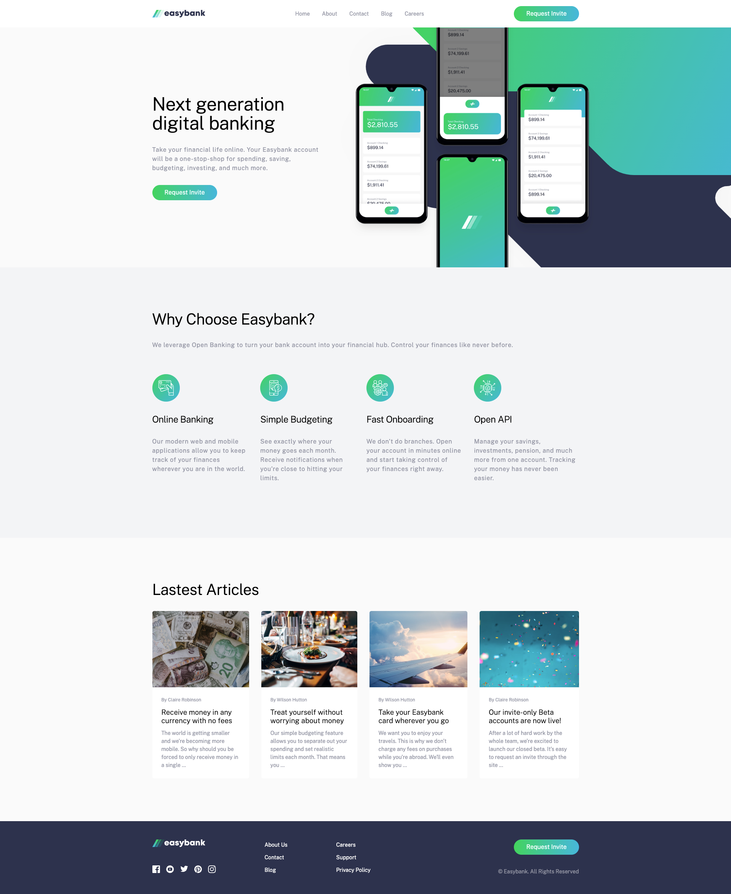

# Frontend Mentor - Easybank landing page solution

This is a solution to the [Easybank landing page challenge on Frontend Mentor](https://www.frontendmentor.io/challenges/easybank-landing-page-WaUhkoDN). Frontend Mentor challenges help you improve your coding skills by building realistic projects.

## Table of contents

- [Overview](#overview)
  - [The challenge](#the-challenge)
  - [Screenshot](#screenshot)
  - [Links](#links)
- [My process](#my-process)
  - [Built with](#built-with)
  - [What I learned](#what-i-learned)
  - [Continued development](#continued-development)
  - [Useful resources](#useful-resources)
- [Author](#author)
- [Acknowledgments](#acknowledgments)

**Note: Delete this note and update the table of contents based on what sections you keep.**

## Overview

This was a fun project to work on.
Mock landing page for a finacial institution. Desktop and mobile friendly.
I started with desktop and worked it into mobile. No frameworks or libraries used just regular HTML, CSS and JS

### The challenge

Users should be able to:

- View the optimal layout for the site depending on their device's screen size
- See hover states for all interactive elements on the page

### Screenshot

You can see other screenshots in the screenshot folder.

### Links

- Solution URL: [Github Repo](https://github.com/calebmcmains/caleb-easybank.git)
- Live Site URL: [Github Page](https://calebmcmains.github.io/caleb-easybank/)

## My process

I spent a good amount of time visualizing the site design. I did not have the figma file. Everything had to be eyeballed.
After looking everything over I started to make all of my root variables that I knew I was going to use throughout the who project. This made styling so much easier and makes changes in the future easier casue most things are based on the variables.
I also seperated my CSS files in to three files:

1. general.css for things I could use anywhere even on a different page of the site if there was one
2. style.css for anything custome to the specific page and elements I was working with
3. queries.css for changing styles to fit specific screen sizes as I moved down to mobile

- I wrote the html by section, so whatever looked like section in the design I would write that HTML
- I got the HTML to where I thought it made sense I wrote classes for all the elements and moved them over to my CSS
- Then I stated styling in CSS to make it look like the design screenshot provided
- Reinse and repeat for each section

### Built with

- Semantic HTML5 markup
- CSS custom properties
- Flexbox
- CSS Grid
- Desktop-first workflow
- Chrome Dev Tools

### What I learned

The biggest thing I learned is that going from Desktop to smaller sizes actually doesnt require you to make too many changes as long as you have set yourself up properly in the beginning.
If some of those core styles and variables wherent there and everything was custom, nothing resuable things would have been different!

Put the prep in, ITS WORTH IT!

### Continued development

I'd love to keep growing in my frontend development. I did struggle working with "::before" and "::after" psudo-elements and really understanding how those work. I'd like to get better with those.
I also had a ton of fun working with Grid and Flexbox, I look forward to getting into that more.
Also accessibility I know nothing! I'd like to be more aware of those things and implement them properly. I feel the resposiblity to do that well for those who rely on it!

### Useful resources

- [Google](https://www.google.com) - I'm serious...don't hesitate to google things....but please work on being GOOD and googling. Theres a difference

## Author

- Website - [Caleb McMains](https://www.calebmcmains.com)
- Frontend Mentor - [@calebmcmains](https://www.frontendmentor.io/profile/calebmcmains)

## Acknowledgments

Shout out to Christian Ark, I viewed his solution to help me with the image behind the image of the main hero section
[Christian Ark's Solution](https://github.com/christianArk/easybank-landing-page.git)
